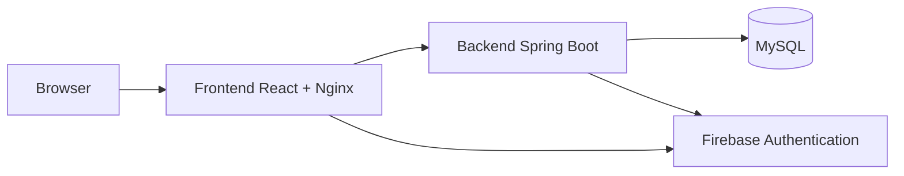
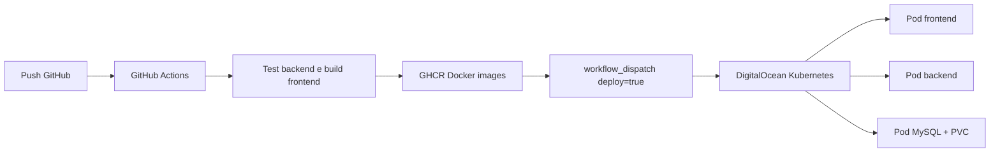

# SmartMall

SmartMall è una web app responsive per gestire prenotazioni negli store di un centro commerciale. Include autenticazione, ruoli, gestione store, disponibilità orarie e prenotazioni.

## Funzionalità principali

- Registrazione e login utenti.
- Consultazione store e slot disponibili anche da visitatore.
- Prenotazione slot da parte dei customer.
- Cancellazione prenotazioni con regole di anticipo.
- Richiesta per diventare merchant: l'approvazione cambia il ruolo, ma non crea automaticamente uno store.
- Gestione store, disponibilità e prenotazioni lato merchant.
- Gestione utenti, store, richieste ruolo e consultazione prenotazioni lato admin.

## Stack tecnico

- Frontend: React 18, Vite, JavaScript, CSS, lucide-react.
- Backend: Java 17, Spring Boot 3.5, Spring Web, Spring Validation.
- Sicurezza: Spring Security, Firebase Authentication, autorizzazione basata su ruoli.
- Database: MySQL 8.
- Persistenza: Spring Data JPA, Hibernate.
- Build: Maven per backend, npm/Vite per frontend.
- Container: Docker, Docker Compose, GHCR.
- Deploy: Kubernetes su DigitalOcean Kubernetes.

## Prerequisiti

- Java 17.
- Node.js 20 e npm.
- Docker Desktop o Docker Engine.
- kubectl.
- Account GitHub con Actions abilitate.
- Account DigitalOcean, solo per creare manualmente il cluster.
- Progetto Firebase già configurato.

## Configurazione locale

Il progetto usa il profilo `dev` di Spring Boot. In locale abilita i dati demo e usa MySQL locale o Docker Compose.

Variabili backend:

```powershell
$env:DB_USERNAME="root"
$env:DB_PASSWORD="root"
$env:FIREBASE_PROJECT_ID="your-project-id"
$env:FIREBASE_SERVICE_ACCOUNT_JSON="{...}"
$env:CORS_ALLOWED_ORIGINS="http://localhost:5173,http://localhost:4173"
$env:ENABLE_DEMO_DATA="true"
```

Variabili frontend:

```powershell
$env:VITE_API_URL="http://localhost:8080"
$env:VITE_FIREBASE_API_KEY="your-api-key"
$env:VITE_FIREBASE_AUTH_DOMAIN="your-project.firebaseapp.com"
$env:VITE_FIREBASE_PROJECT_ID="your-project-id"
$env:VITE_FIREBASE_APP_ID="your-app-id"
```

Il file `.env.example` contiene placeholder sicuri. Non committare file `.env` reali: sono esclusi da `.gitignore`.

## Avvio con Docker Compose

```powershell
docker compose up --build
```

Servizi locali:

```text
Frontend: http://localhost:5173
Backend:  http://localhost:8080
MySQL:    localhost:3306
```

## Avvio backend

Dalla cartella principale:

```powershell
$env:DB_PASSWORD="root"
$env:FIREBASE_PROJECT_ID="your-project-id"
$env:FIREBASE_SERVICE_ACCOUNT_JSON="{...}"
$env:CORS_ALLOWED_ORIGINS="http://localhost:5173,http://localhost:4173"
$env:ENABLE_DEMO_DATA="true"
.\mvnw.cmd spring-boot:run
```

Backend:

```text
http://localhost:8080
```

## Avvio frontend

Da una seconda shell:

```powershell
cd frontend
npm install
npm run dev
```

Frontend:

```text
http://localhost:5173
```

## Credenziali demo

| Ruolo | Email | Password |
| --- | --- | --- |
| Customer | `customer@test.com` | `password123` |
| Merchant | `merchant@test.com` | `password123` |
| Super admin | `admin@test.com` | `password123` |

## Comandi build e test

Backend:

```powershell
.\mvnw.cmd test
.\mvnw.cmd package -DskipTests
```

Frontend:

```powershell
cd frontend
npm ci
npm run build
```

## CI/CD

La pipeline GitHub Actions è definita in `.github/workflows/ci.yml`.

Su pull request:

- esegue i test backend;
- compila il backend;
- compila il frontend.

Su push su `main` o avvio manuale:

- esegue test e build;
- pubblica le immagini Docker su GitHub Container Registry, cioè GHCR.

Il deploy Kubernetes è manuale:

```text
GitHub -> Actions -> CI/CD -> Run workflow -> deploy=true
```

Non parte automaticamente su ogni push. Questo è utile per una demo perché evita deploy involontari.

## Deploy su DigitalOcean Kubernetes

Questa procedura è pensata per 3 studenti e per una demo semplice. Non usa Helm, Terraform, Ingress, LoadBalancer, autoscaling o high availability.

Configurazione cluster:

```text
Provider: DigitalOcean Kubernetes
Regione: FRA1
Node pool: 1 nodo
Tipo nodo: Basic
Dimensione: 4 GB RAM
Autoscaling: disattivato
High availability: disattivata
Database: MySQL dentro Kubernetes
Accesso iniziale: kubectl port-forward
```

Il repository non crea risorse cloud. Il cluster deve essere creato manualmente dal pannello DigitalOcean.

### GitHub Secrets

Configurarli in:

```text
GitHub -> Settings -> Secrets and variables -> Actions -> Secrets
```

Elenco esatto:

```text
KUBE_CONFIG_DATA
DB_PASSWORD
FIREBASE_SERVICE_ACCOUNT_JSON
GHCR_PULL_TOKEN
```

Significato:

- `KUBE_CONFIG_DATA`: kubeconfig del cluster DOKS codificato in Base64.
- `DB_PASSWORD`: password del MySQL dentro Kubernetes.
- `FIREBASE_SERVICE_ACCOUNT_JSON`: JSON del service account Firebase Admin SDK.
- `GHCR_PULL_TOKEN`: serve solo se le immagini GHCR sono private. Se le immagini sono pubbliche, può non essere impostato.

Non inserire questi valori nel repository.

### GitHub Variables

Configurarle in:

```text
GitHub -> Settings -> Secrets and variables -> Actions -> Variables
```

Elenco esatto:

```text
DB_URL
DB_USERNAME
HIBERNATE_DDL_AUTO
SPRING_JPA_SHOW_SQL
SPRING_PROFILES_ACTIVE
FIREBASE_PROJECT_ID
CORS_ALLOWED_ORIGINS
ENABLE_DEMO_DATA
VITE_FIREBASE_API_KEY
VITE_FIREBASE_AUTH_DOMAIN
VITE_FIREBASE_PROJECT_ID
VITE_FIREBASE_APP_ID
GHCR_PULL_USERNAME
```

Valori consigliati per la prima demo con port-forward:

```text
DB_URL=jdbc:mysql://mysql:3306/smartmall?serverTimezone=UTC&useSSL=false&allowPublicKeyRetrieval=true
DB_USERNAME=root
HIBERNATE_DDL_AUTO=update
SPRING_JPA_SHOW_SQL=false
SPRING_PROFILES_ACTIVE=dev
ENABLE_DEMO_DATA=true
CORS_ALLOWED_ORIGINS=http://localhost:5173,http://localhost:4173
```

Variabili Firebase frontend:

```text
VITE_FIREBASE_API_KEY=<valore Firebase web app>
VITE_FIREBASE_AUTH_DOMAIN=<project-id>.firebaseapp.com
VITE_FIREBASE_PROJECT_ID=<project-id>
VITE_FIREBASE_APP_ID=<valore Firebase web app>
```

Variabili Firebase backend:

```text
FIREBASE_PROJECT_ID=<project-id>
```

`GHCR_PULL_USERNAME` serve solo se GHCR è privato. Di solito coincide con l'utente GitHub o con l'owner che ha creato il token.

### Come ottenere KUBE_CONFIG_DATA

Dopo aver creato il cluster DOKS, scaricare il kubeconfig dal pannello DigitalOcean.

Se si usa `doctl`:

```bash
doctl kubernetes cluster kubeconfig save <cluster-name-or-id>
```

Poi codificare il kubeconfig in Base64.

PowerShell:

```powershell
[Convert]::ToBase64String([IO.File]::ReadAllBytes("$env:USERPROFILE\.kube\config"))
```

Bash:

```bash
base64 -w 0 ~/.kube/config
```

Copiare il risultato nel GitHub Secret `KUBE_CONFIG_DATA`.

### Deploy manuale

Da GitHub:

```text
Actions -> CI/CD -> Run workflow
deploy = true
Run workflow
```

La pipeline:

- esegue test e build;
- pubblica le immagini backend e frontend su GHCR;
- crea o aggiorna ConfigMap e Secret nel namespace `smartmall`;
- sostituisce nel manifest le immagini locali con quelle GHCR;
- applica i workload Kubernetes;
- controlla il rollout di MySQL, backend e frontend.

### Verifica dopo il deploy

Controllare pod, service e volume:

```bash
kubectl -n smartmall get pods
kubectl -n smartmall get svc
kubectl -n smartmall get pvc
```

Aprire il frontend con port-forward:

```bash
kubectl -n smartmall port-forward service/frontend 5173:80
```

Poi aprire:

```text
http://localhost:5173
```

Non c'è un URL pubblico perché frontend e backend usano Service di tipo `ClusterIP`. Questo significa che sono raggiungibili dentro il cluster, oppure dal proprio computer tramite `kubectl port-forward`.

Per controllare il backend:

```bash
kubectl -n smartmall port-forward service/backend 8080:8080
```

Poi aprire:

```text
http://localhost:8080/actuator/health
```

### Costi DigitalOcean

I costi possibili sono:

- Nodo Kubernetes Basic 4 GB: è il costo principale e continua finché il cluster esiste.
- PVC MySQL: il manifest crea `mysql-data`, che su DigitalOcean può creare un volume a pagamento.
- Snapshot o backup: costano se vengono attivati manualmente.
- Load Balancer: non dovrebbe essere creato da questo progetto, perché i Service sono `ClusterIP`. Potrebbe comparire solo se qualcuno cambia un Service in `LoadBalancer`.

Eliminare solo i pod non ferma i costi. I pod possono essere ricreati automaticamente da Kubernetes.

Per fermare i costi dopo la demo:

1. Eliminare il cluster Kubernetes dal pannello DigitalOcean.
2. Controllare nella sezione Volumes se sono rimasti volumi collegati al PVC MySQL.
3. Eliminare eventuali volumi non più necessari.
4. Controllare che non esistano Load Balancer creati per errore.

Comando utile per pulire le risorse applicative dentro il cluster:

```bash
kubectl delete namespace smartmall
```

Questo comando non elimina necessariamente il cluster DigitalOcean o tutti i costi collegati. Per fermare davvero i costi, usare il pannello DigitalOcean ed eliminare cluster e volumi.

## Piano B locale con Kubernetes

Con Docker Desktop Kubernetes:

```bash
docker build -t smartmall-backend:latest .
docker build -t smartmall-frontend:latest ./frontend
kubectl apply -f k8s/smartmall.yaml
kubectl -n smartmall get pods
kubectl -n smartmall port-forward service/frontend 5173:80
```

Aprire:

```text
http://localhost:5173
```

Se il cluster locale non vede le immagini Docker locali, usare le immagini GHCR o caricare le immagini nel cluster locale.

## Diagramma applicativo



## Diagramma CI/CD


