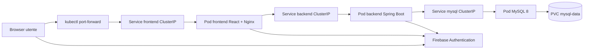
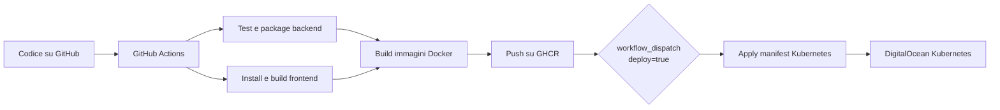

# SmartMall

SmartMall è un'applicazione web per la gestione di prenotazioni presso i negozi di un centro commerciale.

Il progetto permette agli utenti di consultare store e slot disponibili, autenticarsi con Firebase, prenotare uno slot e gestire le proprie prenotazioni. Sono presenti ruoli applicativi distinti per customer, merchant e admin, gestiti nel database del backend.

## Funzionalità principali

- Consultazione degli store disponibili.
- Consultazione degli slot disponibili per store e data.
- Registrazione e login tramite Firebase Authentication.
- Login con Google tramite Firebase Authentication.
- Prenotazione di slot da parte dei customer.
- Visualizzazione e cancellazione delle proprie prenotazioni.
- Ruoli applicativi: `CUSTOMER`, `MERCHANT`, `SUPER_ADMIN`.
- Richiesta per diventare merchant.
- Gestione disponibilità e prenotazioni lato merchant.
- Funzioni amministrative per utenti, store, richieste ruolo e prenotazioni.

Nota: l'approvazione di una richiesta merchant cambia il ruolo dell'utente, ma non crea automaticamente uno store.

## Architettura

SmartMall è composto da:

- frontend React 18 compilato con Vite e servito da Nginx nel container;
- backend Java 17 con Spring Boot 3.5, Spring Security, Spring Data JPA e Hibernate;
- database MySQL 8;
- Firebase Authentication per autenticazione Email/Password e Google;
- ruoli applicativi salvati nel database MySQL;
- immagini Docker per frontend e backend;
- pubblicazione immagini su GitHub Container Registry;
- deploy Kubernetes su un cluster DigitalOcean Kubernetes creato manualmente;
- accesso alla demo cloud tramite `kubectl port-forward`.

Nel deploy Kubernetes i Service `frontend`, `backend` e `mysql` sono di tipo `ClusterIP`. Il backend raggiunge MySQL tramite il Service Kubernetes `mysql`.





## Stack tecnologico

| Livello | Tecnologie |
| --- | --- |
| Frontend | React 18, Vite, JavaScript, CSS, lucide-react |
| Backend | Java 17, Spring Boot 3.5.11, Spring Web, Spring Security, Spring Validation |
| Database | MySQL 8 |
| Persistenza | Spring Data JPA, Hibernate |
| Autenticazione | Firebase Authentication, Firebase Admin SDK |
| Autorizzazione | Ruoli applicativi nel database |
| Container | Docker, Docker Compose |
| Registry | GitHub Container Registry |
| Orchestrazione | Kubernetes |
| CI/CD | GitHub Actions |
| Cloud | DigitalOcean Kubernetes per la demo |

## Struttura del repository

```text
.
├── .github/workflows/ci.yml      Pipeline GitHub Actions
├── .mvn/                         Maven Wrapper
├── frontend/                     Applicazione React + Vite
├── k8s/smartmall.yaml            Manifest Kubernetes
├── src/                          Backend Spring Boot
├── .env.example                  Esempio variabili ambiente
├── docker-compose.yml            Avvio locale con MySQL, backend e frontend
├── Dockerfile                    Immagine Docker backend
├── HELP.md                       Note rapide
├── mvnw, mvnw.cmd                Maven Wrapper
├── pom.xml                       Configurazione Maven backend
└── README.md                     Documentazione del progetto
```

## Scelte progettuali
- Autenticazione Stateless (Firebase + Spring Security): Scelta un'architettura token-based senza sessioni lato server (`SessionCreationPolicy.STATELESS`) per garantire la scalabilità e disaccoppiare la gestione degli utenti dal database relazionale.
- Disaccoppiamento Ruolo/Store (Merchant): L'approvazione del ruolo `MERCHANT` da parte di un admin non genera automaticamente uno store. L'esercente deve configurare il proprio negozio in un secondo momento, garantendo flessibilità gestionale.
- Sicurezza delle credenziali su DB: Le password degli utenti sono cifrate tramite l'algoritmo **BCrypt** (`BCryptPasswordEncoder`).
- ClusterIP e Port-Forwarding (Kubernetes): I servizi in Kubernetes sono esposti come `ClusterIP` anziché `LoadBalancer`. Questa scelta evita l'allocazione di un IP pubblico a pagamento su DigitalOcean, riducendo a zero i costi inutili d'esame e consentendo l'accesso sicuro tramite `kubectl port-forward`.
- Deploy Manuale via Workflow Dispatch: La pipeline di deploy su Kubernetes non scatta in automatico ad ogni commit su `main`, ma richiede l'avvio manuale (`deploy = true`). Questo previene modifiche o sovrascritture accidentali del cluster durante il lavoro di sviluppo.

## Prerequisiti

- Java 17.
- Node.js 20.
- npm.
- Docker o Docker Desktop.
- kubectl.
- Account GitHub con GitHub Actions abilitate.
- Progetto Firebase.
- Account DigitalOcean solo per il deploy cloud.

## Configurazione locale

Il backend legge la configurazione da variabili ambiente. Il file `.env.example` contiene solo placeholder o valori dimostrativi.

Non committare file `.env` reali, kubeconfig, password o service account JSON. I file `.env` sono esclusi da `.gitignore`.

### Variabili backend

```env
DB_URL=jdbc:mysql://localhost:3306/smartmall?serverTimezone=UTC
DB_USERNAME=root
DB_PASSWORD=<password-mysql>
FIREBASE_PROJECT_ID=<firebase-project-id>
FIREBASE_SERVICE_ACCOUNT_JSON=<json-service-account-firebase>
CORS_ALLOWED_ORIGINS=http://localhost:5173,http://localhost:4173
ENABLE_DEMO_DATA=true
HIBERNATE_DDL_AUTO=update
SPRING_JPA_SHOW_SQL=true
SPRING_PROFILES_ACTIVE=dev
```

Significato principale:

| Variabile | Uso |
| --- | --- |
| `DB_URL` | URL JDBC usato da Spring Boot per connettersi a MySQL |
| `DB_USERNAME` | Utente MySQL |
| `DB_PASSWORD` | Password MySQL |
| `FIREBASE_PROJECT_ID` | ID del progetto Firebase |
| `FIREBASE_SERVICE_ACCOUNT_JSON` | JSON del service account Firebase Admin SDK |
| `CORS_ALLOWED_ORIGINS` | Origini frontend abilitate dal backend |
| `ENABLE_DEMO_DATA` | Abilita il seed dimostrativo nel profilo `dev` |
| `HIBERNATE_DDL_AUTO` | Modalità di aggiornamento schema Hibernate |
| `SPRING_JPA_SHOW_SQL` | Mostra o nasconde le query SQL nei log |
| `SPRING_PROFILES_ACTIVE` | Profilo Spring attivo |

### Variabili frontend

```env
VITE_API_URL=http://localhost:8080
VITE_FIREBASE_API_KEY=<firebase-web-api-key>
VITE_FIREBASE_AUTH_DOMAIN=<firebase-project-id>.firebaseapp.com
VITE_FIREBASE_PROJECT_ID=<firebase-project-id>
VITE_FIREBASE_APP_ID=<firebase-web-app-id>
```

Il file `.env.example` contiene placeholder sicuri. Non committare file `.env` reali: assicurarsi che siano inseriti nel file `.gitignore` per evitare la fuga di credenziali.

La configurazione web Firebase è usata dal frontend. Non è equivalente al service account JSON del backend.

## Avvio locale

### Docker Compose

Dalla cartella principale:

```powershell
docker compose up --build
```

URL locali:

```text
Frontend: http://localhost:5173
Backend:  http://localhost:8080
MySQL:    localhost:3306
```

### Backend separato

Avviare prima un database MySQL 8 con database `smartmall`, poi dalla cartella principale:

```powershell
$env:DB_URL="jdbc:mysql://localhost:3306/smartmall?serverTimezone=UTC"
$env:DB_USERNAME="root"
$env:DB_PASSWORD="<password-mysql>"
$env:FIREBASE_PROJECT_ID="<firebase-project-id>"
$env:FIREBASE_SERVICE_ACCOUNT_JSON="<json-service-account-firebase>"
$env:CORS_ALLOWED_ORIGINS="http://localhost:5173,http://localhost:4173"
$env:ENABLE_DEMO_DATA="true"
$env:SPRING_PROFILES_ACTIVE="dev"
.\mvnw.cmd spring-boot:run
```

Backend:

```text
http://localhost:8080
```

Health check:

```text
http://localhost:8080/actuator/health
```

### Frontend separato

Da una seconda shell:

```powershell
cd frontend
npm ci
npm run dev
```

Frontend:

```text
http://localhost:5173
```

Durante lo sviluppo Vite inoltra le chiamate `/api` verso `http://localhost:8080`.

## Utenti demo

Il `DataSeeder` del backend, attivo con profilo `dev` e `ENABLE_DEMO_DATA=true`, crea record dimostrativi nel database.

Gli account demo devono esistere anche in Firebase Authentication, altrimenti il login non può completarsi perché il frontend autentica gli utenti con Firebase.

| Ruolo database | Email | Password demo |
| --- | --- | --- |
| `CUSTOMER` | `customer@test.com` | `password123` |
| `MERCHANT` | `merchant@test.com` | `password123` |
| `SUPER_ADMIN` | `admin@test.com` | `password123` |

Il seed crea anche uno store dimostrativo chiamato `Apple Store`, associato al merchant, con una regola di disponibilità per il sabato.

## Build e test

Backend:

```powershell
.\mvnw.cmd test
.\mvnw.cmd package -DskipTests
```

Frontend:

```powershell
cd frontend
npm ci
npm run build
```

Verifica sintattica del file Docker Compose:

```powershell
docker compose config
```

## Docker

Il backend viene costruito dal `Dockerfile` nella root:

- stage Maven con `maven:3.9.11-eclipse-temurin-17`;
- build del jar con `mvn -q -DskipTests package`;
- runtime con `eclipse-temurin:17-jre`;
- esposizione della porta `8080`.

Il frontend viene costruito da `frontend/Dockerfile`:

- stage Node con `node:20-alpine`;
- installazione dipendenze con `npm ci`;
- build Vite con `npm run build`;
- runtime Nginx con `nginx:1.27-alpine`;
- esposizione della porta `80`.

In GitHub Actions le immagini vengono pubblicate su GHCR con tag basato sul commit:

```text
ghcr.io/<owner>/<repository>-backend:<commit-sha>
ghcr.io/<owner>/<repository>-frontend:<commit-sha>
```

La pipeline pubblica anche il tag `latest`:

```text
ghcr.io/<owner>/<repository>-backend:latest
ghcr.io/<owner>/<repository>-frontend:latest
```

Non inserire token o credenziali Docker nel repository.

## CI/CD

La pipeline è definita in `.github/workflows/ci.yml`.

Parte in questi casi:

- pull request: esegue test e build, ma non pubblica immagini;
- push su `main`: esegue test, build e pubblicazione immagini su GHCR;
- avvio manuale `workflow_dispatch`: può eseguire anche il deploy Kubernetes se `deploy=true`.

Il deploy Kubernetes non parte automaticamente a ogni push. Parte solo da GitHub Actions con:

```text
Actions -> CI/CD -> Run workflow -> deploy=true
```

### Job della pipeline

| Job | Cosa fa |
| --- | --- |
| `backend` | Configura Java 17, esegue `./mvnw test`, crea il jar con `./mvnw -DskipTests package` |
| `frontend` | Configura Node.js 20, esegue `npm ci` e `npm run build` |
| `docker` | Costruisce e pubblica le immagini backend e frontend su GHCR; non gira sulle pull request |
| `deploy` | Configura `kubectl`, crea ConfigMap e Secret, applica i manifest Kubernetes e controlla i rollout |

### GitHub Secrets

Configurare in:

```text
GitHub -> Settings -> Secrets and variables -> Actions -> Secrets
```

| Secret | Sensibile | Uso |
| --- | --- | --- |
| `KUBE_CONFIG_DATA` | Sì | Kubeconfig del cluster codificato Base64 |
| `DB_PASSWORD` | Sì | Password MySQL usata dalla pipeline per creare il Secret Kubernetes |
| `FIREBASE_SERVICE_ACCOUNT_JSON` | Sì | Service account Firebase Admin SDK per il backend |
| `GHCR_PULL_TOKEN` | Sì | Opzionale; necessario se le immagini GHCR sono private |

### GitHub Variables

Configurare in:

```text
GitHub -> Settings -> Secrets and variables -> Actions -> Variables
```

| Variable | Sensibile | Uso |
| --- | --- | --- |
| `DB_URL` | No | URL JDBC nel cluster |
| `DB_USERNAME` | No | Utente MySQL |
| `HIBERNATE_DDL_AUTO` | No | Modalità schema Hibernate |
| `SPRING_JPA_SHOW_SQL` | No | Logging SQL |
| `SPRING_PROFILES_ACTIVE` | No | Profilo Spring |
| `FIREBASE_PROJECT_ID` | No | ID progetto Firebase backend |
| `CORS_ALLOWED_ORIGINS` | No | Origini CORS consentite |
| `ENABLE_DEMO_DATA` | No | Abilitazione seed demo |
| `VITE_FIREBASE_API_KEY` | No | Configurazione web Firebase frontend |
| `VITE_FIREBASE_AUTH_DOMAIN` | No | Configurazione web Firebase frontend |
| `VITE_FIREBASE_PROJECT_ID` | No | Configurazione web Firebase frontend |
| `VITE_FIREBASE_APP_ID` | No | Configurazione web Firebase frontend |
| `GHCR_PULL_USERNAME` | No | Opzionale; utente per pull da GHCR privato |

Valori utili per una demo con port-forward:

```text
DB_URL=jdbc:mysql://mysql:3306/smartmall?serverTimezone=UTC&useSSL=false&allowPublicKeyRetrieval=true
DB_USERNAME=root
HIBERNATE_DDL_AUTO=update
SPRING_JPA_SHOW_SQL=false
SPRING_PROFILES_ACTIVE=dev
ENABLE_DEMO_DATA=true
CORS_ALLOWED_ORIGINS=http://localhost:5173,http://localhost:4173
```

## Deploy Kubernetes su DigitalOcean

Il repository non crea il cluster cloud. Il cluster DigitalOcean Kubernetes viene creato manualmente e distrutto dopo la demo per evitare costi.

Configurazione usata per la demo cloud:

| Voce | Valore |
| --- | --- |
| Nodi | 1 nodo |
| Risorse nodo | 2 vCPU, 4 GiB RAM, 80 GiB disco |
| High availability | Non abilitata |
| Accesso applicazione | `kubectl port-forward` |
| Service pubblici | Non presenti nel manifest |

### Procedura

1. Creare manualmente un cluster DigitalOcean Kubernetes dalla console DigitalOcean.
2. Scaricare il kubeconfig del cluster.
3. Codificare il kubeconfig in Base64.
4. Salvare il valore Base64 nel GitHub Secret `KUBE_CONFIG_DATA`.
5. Configurare GitHub Secrets e GitHub Variables richiesti dalla pipeline.
6. Avviare manualmente il workflow `CI/CD` con `deploy=true`.
7. Verificare pod, servizi e PVC.
8. Aprire frontend e backend tramite `kubectl port-forward`.

### Creazione di `KUBE_CONFIG_DATA`

PowerShell:

```powershell
[Convert]::ToBase64String([IO.File]::ReadAllBytes("$env:USERPROFILE\.kube\config"))
```

Bash:

```bash
base64 -w 0 ~/.kube/config
```

Se il cluster viene distrutto e ricreato, il kubeconfig cambia: aggiornare anche `KUBE_CONFIG_DATA`.

### Risorse Kubernetes

Il manifest `k8s/smartmall.yaml` definisce:

- namespace `smartmall`;
- ConfigMap `smartmall-config`;
- Secret `smartmall-secret`;
- PVC `mysql-data` da `1Gi`;
- Deployment `mysql` con immagine `mysql:8.0`;
- Deployment `backend`;
- Deployment `frontend`;
- Service `mysql`, `backend` e `frontend` di tipo `ClusterIP`.

Durante la demo verificata, i pod `backend`, `frontend` e `mysql` risultavano in stato `Running` con readiness `1/1`, e il PVC `mysql-data` risultava `Bound` con capacità `1Gi` e storage class `do-block-storage`.

MySQL usa:

```yaml
strategy:
  type: Recreate
```

Questa strategia evita che due pod MySQL dello stesso Deployment provino a usare contemporaneamente lo stesso volume.

Il container MySQL usa anche:

```text
MYSQL_ROOT_HOST=%
```

Questo permette connessioni dell'utente `root` da pod diversi, ad esempio dal backend. MySQL applica questa impostazione quando inizializza il proprio data directory. Se il PVC esisteva già prima, i permessi salvati nel volume possono non cambiare: in quel caso può servire eliminare namespace e PVC e poi rieseguire il deploy.

### Accesso alla demo

Frontend:

```bash
kubectl -n smartmall port-forward service/frontend 5173:80
```

Aprire:

```text
http://localhost:5173
```

Backend:

```bash
kubectl -n smartmall port-forward service/backend 8080:8080
```

Aprire:

```text
http://localhost:8080/actuator/health
```

`ClusterIP` significa che il servizio è raggiungibile dentro il cluster. Senza Ingress o Load Balancer, dall'esterno si accede con `kubectl port-forward`.

## Comandi di verifica

```bash
kubectl -n smartmall get pods
kubectl -n smartmall get svc
kubectl -n smartmall get pvc
kubectl -n smartmall get events --sort-by=.lastTimestamp
kubectl -n smartmall logs deployment/backend --tail=120
kubectl -n smartmall logs deployment/mysql --tail=120
kubectl -n smartmall logs deployment/frontend --tail=120
kubectl -n smartmall port-forward service/frontend 5173:80
kubectl -n smartmall port-forward service/backend 8080:8080
```

Per dettagli su un pod specifico:

```bash
kubectl -n smartmall describe pod <pod-name>
```

## Troubleshooting

| Problema | Causa probabile | Comando utile |
| --- | --- | --- |
| `CrashLoopBackOff` backend | Variabili mancanti, errore Firebase, MySQL non raggiungibile o credenziali database errate | `kubectl -n smartmall logs deployment/backend --tail=120` |
| `ImagePullBackOff` | Immagine GHCR privata senza pull secret, tag errato o immagine non pubblicata | `kubectl -n smartmall describe pod <pod-name>` |
| PVC `Pending` | StorageClass non disponibile o volume non ancora creato dal provider | `kubectl -n smartmall describe pvc mysql-data` |
| Rollout timeout | Readiness probe fallita, risorse insufficienti o pod non pronto | `kubectl -n smartmall get events --sort-by=.lastTimestamp` |
| `Host is not allowed to connect to this MySQL server` | PVC inizializzato prima di `MYSQL_ROOT_HOST=%` o permessi MySQL non coerenti | `kubectl -n smartmall logs deployment/mysql --tail=120` |
| `Unable to lock ibdata1` | Più processi MySQL stanno tentando di usare lo stesso data directory o il volume è ancora bloccato | `kubectl -n smartmall get pods -l app=mysql` |
| Login demo non funzionante | Account demo assente in Firebase Authentication, password diversa o provider Firebase non abilitato | `kubectl -n smartmall logs deployment/backend --tail=120` |

## Costi e pulizia

Su DigitalOcean possono generare costi:

- nodo del cluster Kubernetes;
- volume associato al PVC MySQL;
- eventuali Load Balancer creati manualmente o da modifiche ai Service;
- eventuali snapshot o backup attivati manualmente.

Nella configurazione di demo mostrata dalla console DigitalOcean, il costo stimato del cluster era circa `$24/month`, esclusi eventuali altri servizi aggiunti al cluster.

Eliminare solo pod o namespace non basta necessariamente a fermare tutti i costi. I pod possono essere ricreati dai Deployment e i volumi cloud possono rimanere presenti.

Procedura finale dopo la demo:

1. Distruggere il cluster Kubernetes dalla console DigitalOcean.
2. Selezionare ed eliminare eventuali volumi associati al PVC MySQL non più necessari.
3. Controllare la sezione `Volumes`.
4. Controllare la sezione `Load Balancers`.

Per rimuovere le risorse applicative dentro un cluster ancora attivo:

```bash
kubectl delete namespace smartmall
```

Se il cluster viene ricreato, aggiornare il GitHub Secret `KUBE_CONFIG_DATA` con il nuovo kubeconfig codificato Base64.

## Sicurezza

- Non committare file `.env`.
- Non committare service account JSON Firebase.
- Non committare kubeconfig.
- Non committare password o token.
- La Firebase web config del frontend non è equivalente al service account JSON.
- I Secret Kubernetes vengono creati dalla pipeline a partire dai GitHub Secrets.
- Il manifest Kubernetes contiene placeholder, non credenziali reali.

## Limiti attuali

- Cluster demo con un solo nodo.
- Nessuna alta disponibilità.
- Nessun Ingress.
- Nessun Load Balancer.
- Nessun dominio pubblico.
- Accesso alla demo tramite `kubectl port-forward`.
- MySQL eseguito dentro Kubernetes.
- Architettura pensata per demo universitaria, non per produzione.

## Possibili sviluppi futuri

- Ingress.
- HTTPS.
- Dominio pubblico.
- Database gestito.
- Autoscaling.
- Alta disponibilità.
- Monitoring.
- Backup.
- Secret manager.

Questi elementi sono sviluppi futuri: non sono funzionalità presenti nel repository.

## Sezione per l'esame

Il flusso dimostrato dal progetto è:

```text
codice -> test -> build -> immagini Docker -> registry GHCR -> deploy Kubernetes
```

Concetti cloud-native dimostrati:

- containerizzazione di frontend e backend;
- orchestrazione Kubernetes;
- configurazione esterna tramite ConfigMap, Secret e variabili ambiente;
- CI/CD con GitHub Actions;
- registry container con GHCR;
- storage persistente con PVC per MySQL;
- autenticazione esterna con Firebase Authentication;
- deploy su cloud provider tramite DigitalOcean Kubernetes;
- esposizione controllata dei servizi tramite port-forward.

## Uso dell'AI

Durante lo sviluppo del progetto è stata usata anche AI generativa, in particolare assistenti come ChatGPT/Codex, come supporto al lavoro del team.

L'AI è stata utilizzata per attività di assistenza tecnica, revisione, documentazione e supporto alla risoluzione di problemi legati a configurazione, Docker, CI/CD e Kubernetes. Le scelte progettuali, la validazione del funzionamento, l'integrazione nel repository e la responsabilità finale del codice restano a carico dei contributori del progetto.

## Contributori

Contributori recuperati dalla cronologia Git e dai metadati del progetto:

- Alessio Boninti
- Leonardo Costantini
- Federico Renna

## Licenza

Questo progetto e stato sviluppato per finalita didattiche/universitarie.

Il codice e distribuito secondo la licenza MIT, salvo diversa indicazione. Vedere il file `LICENSE` per i dettagli.
